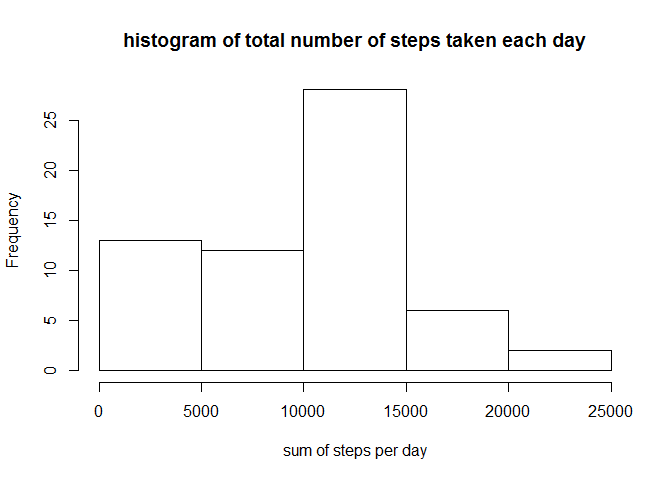

# Reproducible Research: Peer Assessment 1
GW  
October 17, 2017  


# Load data (assume the activity file in the current work directory)

```r
All.Data <- read.csv("activity.csv")
```

## What is mean total number of steps taken per day

```r
Total.Steps <- tapply(All.Data$steps, All.Data$date, sum, na.rm = T)
```

# Plot a histogram

```r
hist(Total.Steps, xlab = "sum of steps per day", 
     main = "histogram of total number of steps taken each day")
```

<!-- -->

# The mean and median of the total number of steps taken per day 

```r
mean.Total.Steps <- round(mean(Total.Steps))
median.Total.Steps <- round(median(Total.Steps))
```

# mean of the total number of steps taken per day

```r
mean.Total.Steps
```

```
## [1] 9354
```

# median of the total number of steps taken per day

```r
median.Total.Steps
```

```
## [1] 10395
```


## What is the average daily activity pattern
# plot average steps

```r
Average.Steps <- tapply(All.Data$steps, All.Data$interval, mean, na.rm=T)
plot(Average.Steps ~ unique(All.Data$interval), type="l", 
     xlab = "5-minute interval")
```

<!-- -->

# maximum number of steps

```r
Average.Steps[which.max(Average.Steps)]
```

```
##      835 
## 206.1698
```


## Imputing missing values
# Calculate and report the total number of missing values in the dataset

```r
number.Na = sum(is.na(All.Data$steps))
number.Na
```

```
## [1] 2304
```


# Devise a strategy for filling in all of the missing values in the dataset (mean for that 5-minute interval). Create a new dataset that is equal to the original dataset but with the missing data filled in

```r
NoNA.Data <- All.Data  # creation of the dataset that will have no more NAs
for (i in 1:nrow(All.Data)){
    if(is.na(All.Data$steps[i])){
        NoNA.Data$steps[i]<- Average.Steps[[as.character(All.Data[i,
                                          "interval"])]]
    }
}
```

# Make a histogram of the total number of steps taken each day. 

```r
Total.Steps2 <- tapply(NoNA.Data$steps, NoNA.Data$date, sum, na.rm=T)
hist(Total.Steps2, xlab = "sum of steps per day", 
     main = "histogram of total number of steps taken each day")
```

<!-- -->


# Calculate and report the mean and median total number of steps taken per day

```r
mean.Total.Steps2 <- round(mean(Total.Steps2))
median.Total.Steps2 <- round(median(Total.Steps2))
```

# the mean total number of steps taken per day

```r
mean.Total.Steps2 
```

```
## [1] 10766
```

# the median total number of steps taken per day

```r
median.Total.Steps2
```

```
## [1] 10766
```


# Do these values differ from the estimates from the first part of the assignment? What is the impact of imputing missing data on the estimates of the total daily number of steps?


```r
paste("with NAs, mean is:",  mean.Total.Steps, "; without NAs, mean is:", mean.Total.Steps2, ". They are different")
```

```
## [1] "with NAs, mean is: 9354 ; without NAs, mean is: 10766 . They are different"
```

```r
paste("with NAs, median is:",  median.Total.Steps, "; without NAs, median is:", median.Total.Steps2, ". They are different")
```

```
## [1] "with NAs, median is: 10395 ; without NAs, median is: 10766 . They are different"
```


## Are there differences in activity patterns between weekdays and weekends?

```r
NoNA.Data$weekday <- c("weekday")
NoNA.Data[weekdays(as.Date(NoNA.Data[, 2])) %in% c("Saturday", "Sunday",  "saturday", "sunday"), ][4] <- c("weekend")
```


# create "weekday" and "weekend"

```r
NoNA.Data$weekday <- factor(NoNA.Data$weekday)
NoNA.Data_weekend <- subset(NoNA.Data, NoNA.Data$weekday == "weekend")
NoNA.Data_weekday <- subset(NoNA.Data, NoNA.Data$weekday == "weekday")

mean_NoNA.Data_weekday <- tapply(NoNA.Data_weekday$steps, 
                                 NoNA.Data_weekday$interval, mean)
mean_NoNA.Data_weekend <- tapply(NoNA.Data_weekend$steps, 
                                 NoNA.Data_weekend$interval, mean)
```


# Make a panel plot containing a time series plot

```r
library(lattice)

df_weekday <- data.frame(interval = unique(NoNA.Data_weekday$interval), 
                         avg = as.numeric(mean_NoNA.Data_weekday), 
                         day = rep("weekday", length(mean_NoNA.Data_weekday)))
df_weekend <- data.frame(interval = unique(NoNA.Data_weekend$interval), 
                         avg = as.numeric(mean_NoNA.Data_weekend), 
                         day = rep("weekend", length(mean_NoNA.Data_weekend)))
df_All <- rbind(df_weekday, df_weekend)

xyplot(avg ~ interval | day, data = df_All, layout = c(1, 2), 
       type = "l", ylab = "average number of steps")
```

<!-- -->


